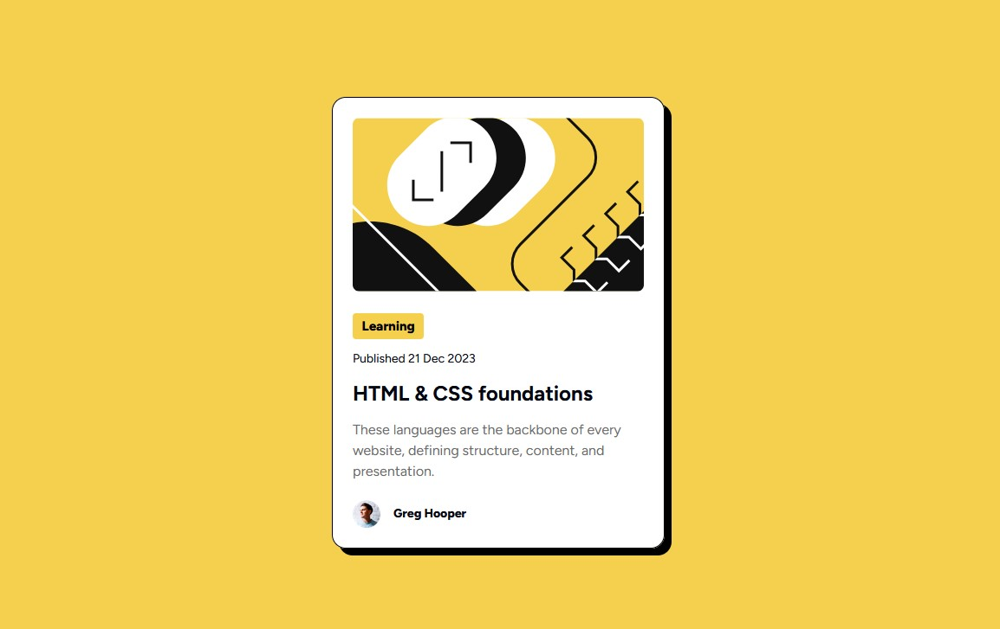

# Frontend Mentor - Blog preview card solution

This is my  solution to the [Blog preview card challenge on Frontend Mentor](https://www.frontendmentor.io/challenges/blog-preview-card-ckPaj01IcS).

## Table of contents

- [Overview](#overview)
  - [Screenshot](#screenshot)
  - [Links](#links)
- [My process](#my-process)
  - [Built with](#built-with)
  - [What I learned](#what-i-learned)
  - [Continued development](#continued-development)
- [Author](#author)

## Overview

### Screenshot

[Screenshot Desktop Version](./screenshots/screenshot_desktop.jpg)
[Screenshot Desktop (with hover) Version](./screenshots/screenshot_desktop_hover.jpg)
[Screenshot Mobile Version](./screenshots/screenshot_mobile.jpg)

### Links

- Solution URL: [Solution URL](https://github.com/ddg-dev/FM-blog-preview-card)
- Live Site URL: [Live site URL](https://ddg-dev.github.io/FM-blog-preview-card/)

## My process

### Built with

- Semantic HTML5 markup
- CSS custom properties
- Flexbox

### What I learned

I did the same design for the Desktop and Mobile versions by using Flexbox.

### Continued development

I will improve my work, working more on Flexbox.

## Author

- GitHub - [ddg-dev](https://github.com/ddg-dev)
- Frontend Mentor - [@ddg-dev](https://www.frontendmentor.io/profile/ddg-dev)
- LinkedIn - [Dany Da Graça](https://www.linkedin.com/in/dany-da-graca/)